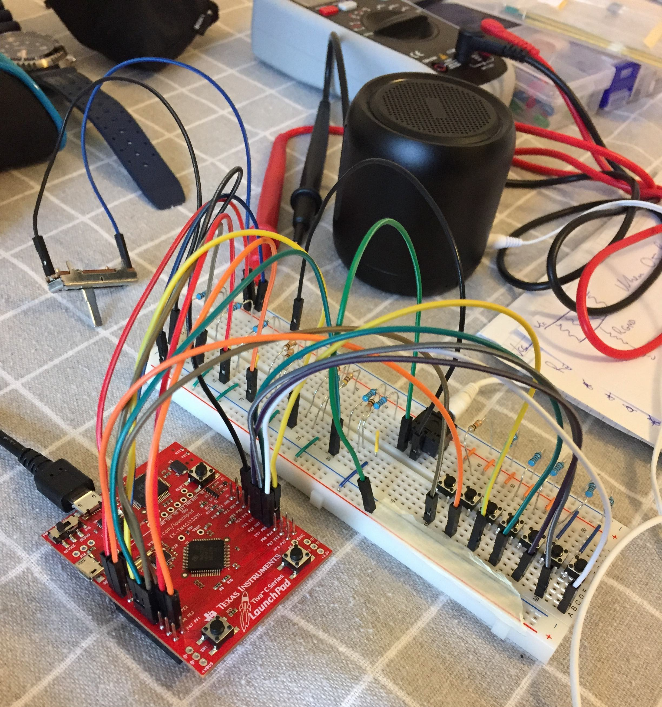

# Blinky

A collection of 30 mini-projects for the Texas Instruments [TM4C123G LaunchPad Evaluation Kit](https://www.ti.com/tool/EK-TM4C123GXL).  
The board features a 80-MHz Arm Cortex-M4F CPU, 256kB of flash, 32kB of SRAM, and a whole bunch of peripherals

[Project 11](projects/11_piano_keyboard), a 6-bit binary-weighted DAC:



The same project [on YouTube](https://www.youtube.com/shorts/_X9xUjwxpHI)

## Overview

Goal of this repository was to experiment with most features and peripherals that could be found on the board.

[Project 1](projects/01_led_blink_with_registers), for example, simply blinks the onboard LED using direct registers manipulation.  
[Project 2](projects/02_led_blink_with_driverlib), instead, is a rewrite of the first using TivaWare™ Peripheral Driver Library.  
[Project 8](projects/08_potentiometer) sets up the ADC peripheral to read the voltage from a potentiometer.  
[Project 12](projects/12_static_dynamic_interrupt_sleep) shows how to register interrupts statically and dynamically.  
[Projects 17](projects/17_power_modes) and [18](projects/18_hibernation) test the different power modes, namely "run", "sleep", "deep-sleep", and "hibernation".  
And so forth.

Projects are placed in the [`projects`](projects) directory.  
Each project contains at least a `main.c` file, with a short description of what the project is doing on top.  
If an external circuit is required, you can generally find the circuit's diagram as SVG file in the related directory.  

## Inspiration

Some of the projects you see here are inspired from these books, which I highly recommend:

* "Introduction to ARM Cortex-M Microcontrollers", by Jonathan W. Valvano - ISBN 978-1477508992
* "Real-Time Interfacing to ARM Cortex-M Microcontrollers", by Jonathan W. Valvano - ISBN 978-1463590154
* "Real-Time Operating Systems for ARM Cortex-M Microcontrollers", by Jonathan W. Valvano - ISBN 978-1466468863

These books did a great job at showcasing the features available on the ARM Cortex-M4F processor, and at making the official datasheet more accessible.

If you'll pick up the books, however, you'll notice that the code style differs significantly.  
In short, Prof. Valvano favored direct registers manipulation, while I favored the [TivaWare™ Peripheral Driver Library](https://www.ti.com/lit/ug/spmu298e/spmu298e.pdf).  
There are of course advantages and disadvantages to each approach.  
Direct registers manipulation forces you to dig deep into the [processor's datasheet](https://www.ti.com/lit/ds/spms376e/spms376e.pdf) (1411 pages) and get very intimate with it, which is good for learning.  
On the other hand, this approach is very error prone and leads to non-portable and hard to read code.  
The drivers library, instead, fixes the disadvantages of the direct registers manipulation (they created it for a damn reason!), but could lead to less optimal code.

## Blinking the LED on Code Composer Studio

This entire repository was built using the [Code Composer Studio IDE](https://www.ti.com/tool/CCSTUDIO) from Texas Instruments.  
If you want to try the projects on your board, make sure you install it (along with the suite of tools it comes with), and set it up for the TM4C123G board.

On the top-level directory you can find three files:

* [`blinky_ccs.cmd`](blinky_ccs.cmd), the linker script;
* [`startup_ccs.c`](startup_ccs.c), the startup file (i.e. what's run before function `main` is called);
* [`blinky.c`](blinky.c), a simple program that toggles the onboard LED.

You should be able to import them into Code Composer Studio (CCS), compile them, run them, and see the LED blinking.  
Don't try to run the other projects before you're sure this one works fine!

The reason I'm pressing for CCS is because the three files above aren't really all you need.  
In fact, the reset handler in the interrupt vector table jumps to CCS's initialization routine, which is NOT PART of this repo.  
In other words, you'll get a linker error.

*startup_ccs.c*
```c
void ResetISR(void)
{
    __asm("    .global _c_int00\n" /* this symbol is provided by CCS! */
          "    b.w     _c_int00");
}
```

## Running the other projects

Projects are stored in the [`projects`](projects) directory and are ordered from 1 to 30.  
This order isn't an indication of complexity, just the chronological order they've been built.  

Each project is self-contained, that is, it contains all the files it needs to be run.  
Exceptions are:
* [`blinky_ccs.cmd`](blinky_ccs.cmd): common linker script for all projects;
* [`startup_ccs.c`](startup_ccs.c): common startup file for all projects;
* [`utils/`](utils) directory: common utility functions for all projects;
* [`include/`](include) directory: header files for the utility functions.

To run a project, copy paste its files into the top-level directory, delete `blinky.c`, compile, and run!  
In other words:
```sh
cd blinky-tm4c
rm blinky.c
cp projects/14_pulse_measurement/* . # or whatever other project you want to run
# then compile and run from CCS Studio
```

## Datasheets

Included in this repo are the user's guide for the TivaWare™ Peripheral Driver Library, and the datasheets for processor, evaluation board, and the other components used.  
You can find them under the [`datasheets`](datasheets) directory.
